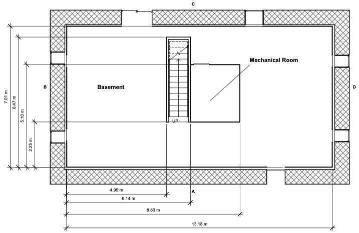
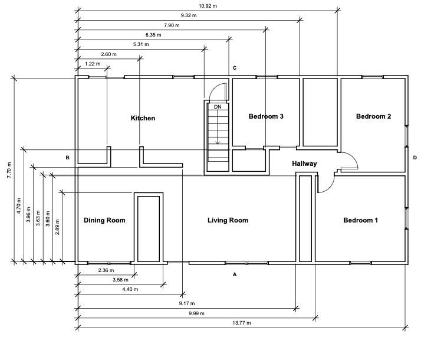
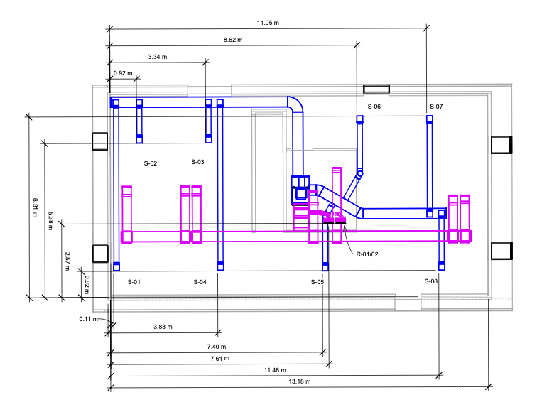
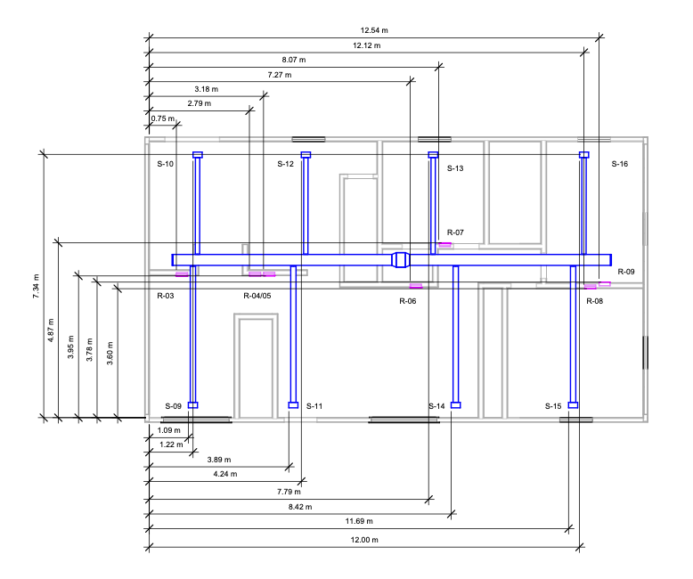
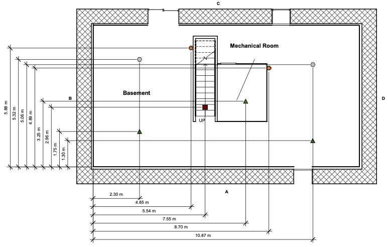
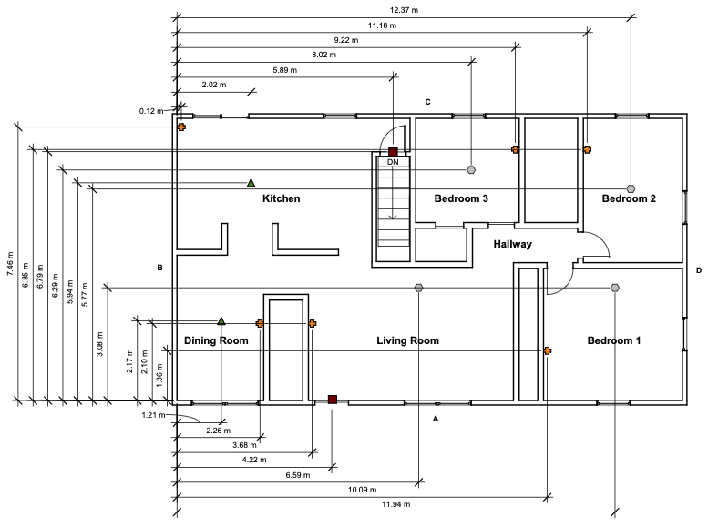
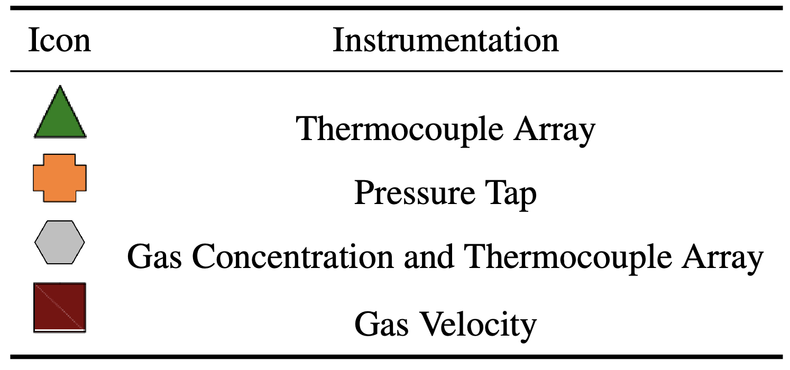

# Experimental Information

## Structure Information

The structure was a ranch-style house with an above ground basement. The outer wall of the basement was composed of interlocking concrete blocks 0.6 m (2.0 ft) wide, 0.6 m (2.0 ft) high, and 1.2 m (4.0 ft) long. The concrete blocks acted as insulation to simulate the basement being below ground level. The interior dimensions of the basement were 13.18 m (43.2 ft) wide, 7.07 m (23.0 ft) long, and 2.74 m (9.0 ft) high. The joints and gaps between the blocks were filled with high-temperature insulation. The walls were constructed from dimensional lumber, 3.81 cm by 8.89 cm (2x4 studs). The studs were lined with 1.27 cm (0.5 in.) drywall. The ceiling had a single layer of 1.27 cm (0.5 in.) drywall over engineered lumber I-joists. 

The exterior walls of the first floor were protected by 8 mm (0.31 in.) thick fiber cement board siding, a layer of olefin home wrap, and 1.27 cm (0.5 in.) oriented strand board (OSB). The walls were constructed from nominal dimension lumber, 3.81 cm by 8.89 cm (2x4 studs). The studs were lined with 1.27 cm (0.5 in.) drywall. The interior dimensions of the first floor measured 13.77 m (45.2 ft) by 7.70 m (25.3 ft) with a 2.44 m (8 ft) ceiling.

To characterize ventilation within the structure, a leakage test was conducted with all exterior vents closed. ASTM E 779, “Standard Test Method for Determining Air Leakage Rate by Fan Pressurization,” was followed to determine the air changes per area and the equivalent leakage area. The leakage in the test structure was 8.3 air changes per hour (ACPH) at 50 Pa (0.007 psi) with an equivalent leakage area of 0.14 m2 (1.5 ft2).

## Heating Ventilation and Air Conditioning System

A residential heating, ventilation and air conditioning (HVAC) system was installed in the structure. The HVAC system used metal/flex ductwork to transport conditioned air through- out the structure. The system included an 18 kW heater with a heating capacity of 10.5 kW (36,000 BTU/hr). The system had a 3 ton capacity with a 0.37 kW (1/2 horsepower), 5-speed motor. The motor was 45 cm (17.5 in.) wide which resulted in a capacity of approximately 2040 m3/hr (1200 scfm). R410A refrigerant was used as the cooling fluid that conditions the air in a single stage air handler. The condensing unit for the HVAC system was located along the exterior delta wall of the structure. The condensing unit used was a heat pump type model utilizing R410A refrigerant, a single stage motor and a capacity of 36,000 BTU.

The supply system originated in the basement mechanical room and extended out through the top of the furnace unit. The system then split into three separate ducts, two that fed the basement and one that fed the first floor. The ducts that supplied the two basement branches measured 36 cm by 20 cm (14 in. by 8 in.). The two branches led to eight supply vents in the basement. Each supply was fed by an 18 cm (7 in.) diameter circular duct that branched off of the main supply duct. With the exception of two supply vents in the C/D quadrant of the basement that measured 28 cm by 28 cm (11 in. by 11 in.), the basement supply vents measured 24 cm by 24 cm (9-3/8 in. by 9-3/8 in).

The first floor of the structure had eight supply vents. The single duct that ran from the basement to first floor measured 40 cm by 20 cm (16 in. by 8 in.) split into two ducts in the attic; each duct measured 30 cm by 20 cm (12 in. by 8 in.) and fed the left and right sides of the structure. The branches that supplied the first floor vents were circular with a 15 cm (6 in.) radius. The supply vents on the first floor were all 30 cm by 15 cm (12 in. by 6 in.) 

All return ducts terminated at the furnace in the basement mechanical room. Two branches of return ductwork combined the return air to the furnace from the entire structure to a single duct that measured 51 cm by 25 cm (20 in. by 10 in.) There were seven return vents in the structure, two of which were considered 'double returns'. All single return vents measures 36 cm by 25 cm (14 in. by 10 in.) while the double return vents measured 66 cm by 25 cm (26 in. by 10 in.). Each return vent fed into a plenum space consisting of either a floor joist space or a wall stud space. The plenum spaces fed into the return ductwork that measured 36 cm by 20 cm (14 in. by 8 in.).

Prior to the start of experiments, a flow hood was utilized to capture the flow rates out of each supply vent and in through each return vent while the HVAC system was running. The measured flows are presented in the following table.

|Vent        | Measured Flows (CFM)   |
|------------|--------------------|
|S-01        | 110                |
|S-02        | 115                |
|S-03        | 105                |
|S-04        | 85                 |
|S-05        | 70                 |
|S-06        | 65                 |
|S-07        | 90                 |
|S-08        | 100                |
|S-09        | 55                 |
|S-10        | 50                 |
|S-11        | 55                 |
|S-12        | 55                 |
|S-13        | 50                 |
|S-14        | 55                 |
|S-15        | 65                 |
|S-16        | 50                 |
|R-01/02     | 525                |
|R-03        | 65                 |
|R-04/05     | 130                |
|R-06        | 75                 |
|R-07        | 55                 |
|R-08        | 30                 |
|R-09        | 30                 |

## Instrumentation

The structure in these experiments was instrumented to measure gas temperature, gas velocity, gas concentrations and pressure. Instruments utilized during the experiments included thermocouples, pressure transducers, bi-directional probes, gas analyzers. The coordinate triple for the location of each instrument is included in the the channel list files in this directory. The dimensions are based on the floor at A/B corner (front left) of each respective floor being set to (0,0,0).

The layout of the basement and first floor instrumentation locations and legend are included below. 

